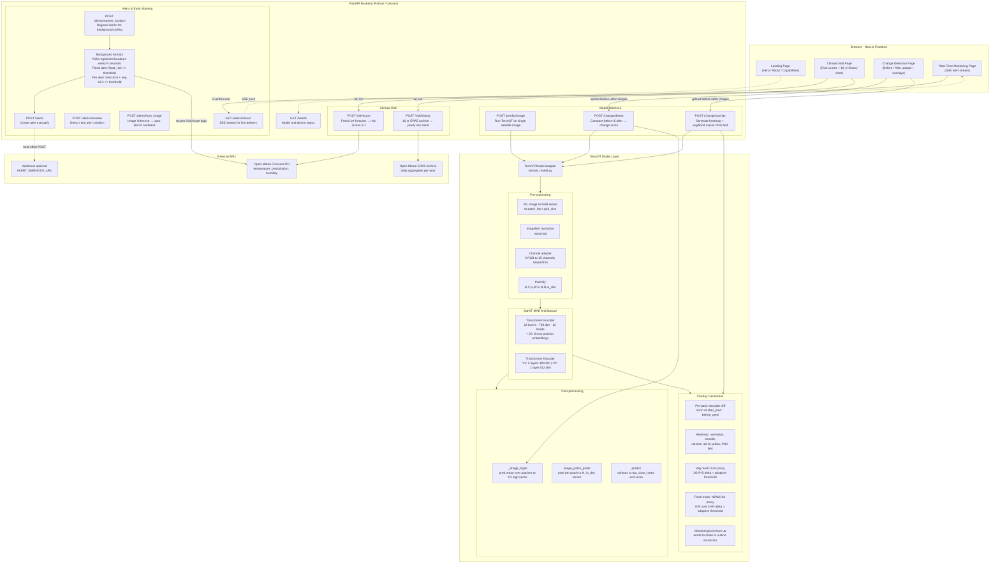

# 🌍 TerraViT - Vision Transformer for Earth's Future

> **TerraViT** is an AI-powered climate intelligence platform that combines a **satellite-imagery Vision Transformer** (ViT) with real-time climate data to detect land-cover change, assess environmental risk, and stream early-warning alerts - all through a modern, interactive web interface.

---

## What is TerraViT?

TerraViT wraps **SatViT** - a Masked Autoencoder (MAE) Vision Transformer pre-trained on multi-spectral satellite imagery - in a production-ready full-stack application. Users can:

- 🛰️ **Upload satellite images** and run instant AI inference to understand land-cover patterns
- 🔄 **Compare before/after images** to detect vegetation loss, flooding, or urban sprawl with visual heatmaps and masks
- 🌡️ **Get real-time climate risk scores** (heat, flood, vegetation stress, air quality) for any GPS coordinate via Open-Meteo
- 📈 **Explore 10-year historical climate trends** for any location
- 🚨 **Receive live early-warning alerts** over a Server-Sent Events (SSE) stream when risk thresholds are exceeded
- 🗺️ **Register locations** for continuous background monitoring with automated flood/fire alerting

---

## Tech Stack

| Layer | Technology |
|---|---|
| **AI Model** | SatViT (MAE ViT), PyTorch, `einops`, `torchvision` |
| **Backend** | FastAPI (Python), Uvicorn, Pydantic, `httpx` |
| **Climate Data** | Open-Meteo (forecast + ERA5 archive) |
| **Frontend** | Next.js 14 (App Router), TypeScript, Tailwind CSS, shadcn/ui |
| **Real-time** | Server-Sent Events (SSE) |
| **Image Processing** | Pillow, NumPy |

---

## Project Structure

```
TerraViT/
├── fast-api-backend/        # Python FastAPI service
│   ├── main.py              # API routes & application entrypoint
│   ├── terravit_model.py    # TerraViT model wrapper (load, preprocess, infer)
│   ├── SatViT_model.py      # SatViT MAE architecture (encoder + decoder)
│   ├── schemas.py           # Pydantic request/response models
│   ├── SatViT_V1.pt         # Model weights – V1 (patch=16, patches=256)
│   ├── SatViT_V2.pt         # Model weights – V2 (patch=8, patches=1024)
│   └── requirements.txt     # Python dependencies
│
├── frontend/                # Next.js web application
│   ├── app/                 # App Router pages
│   │   ├── page.tsx                     # Landing page
│   │   ├── climate-intel/               # Climate risk dashboard
│   │   ├── satellite-change-detection/  # Before/after change detection
│   │   └── real-time-monitoring/        # Live alert stream
│   ├── components/
│   │   ├── landing/         # Hero, About, Capabilities, HowItWorks, etc.
│   │   └── ui/              # Shared shadcn/ui primitives
│   └── lib/                 # Utility helpers
│
└── images/                  # Sample before/after satellite image pairs for demo
```

---

## Architecture

The diagram below shows how every major piece of TerraViT fits together - from a user uploading a satellite image in the browser, through the FastAPI backend, down to the SatViT neural network, and back as scores, overlays, and real-time alerts.



---

## API Reference

### Inference

| Method | Endpoint | Description |
|--------|----------|-------------|
| `GET` | `/health` | Model load status + device (CPU/CUDA) |
| `POST` | `/predict/image` | Upload satellite image → top class index & score |
| `POST` | `/change/detect` | Upload before+after → per-class change score vector |
| `POST` | `/change/overlay` | Upload before+after → heatmap, veg mask, flood mask (PNG base64) |

### Climate Risk

| Method | Endpoint | Description |
|--------|----------|-------------|
| `POST` | `/risk/score` | `{lat, lon}` → real-time risk scores (heat, flood, veg, air, overall) |
| `POST` | `/risk/history` | `{lat, lon}` → 10-year yearly risk score history from ERA5 |

### Alerts & Early Warning

| Method | Endpoint | Description |
|--------|----------|-------------|
| `GET` | `/alerts` | List all stored alerts |
| `POST` | `/alerts` | Manually create an alert |
| `POST` | `/alerts/simulate` | Simulate an alert (demo/testing) |
| `POST` | `/alerts/from_image` | Upload image → auto-create alert if model confidence ≥ threshold |
| `GET` | `/alerts/stream` | SSE stream - connect via `EventSource` for live alerts |
| `POST` | `/alerts/register_location` | Register a lat/lon for background periodic monitoring |

### Risk Score Heuristics

All risk values are clamped to **[0, 1]**:

| Score | Formula |
|---|---|
| `heat_risk` | `clamp((max_temp − 25) / 15)` - saturates at 40 °C |
| `flood_risk` | `clamp(total_precip / 50)` - saturates at 50 mm/day (1 000 mm/yr for history) |
| `vegetation_stress` | `clamp((60 − avg_humidity) / 40)` - very low humidity → high stress |
| `air_quality_proxy` | `heat_risk × 0.5 + vegetation_stress × 0.5` |
| `overall_risk` | `0.35·heat + 0.30·flood + 0.20·veg + 0.15·air` |

---

## Quick Start

### Backend

```bash
cd fast-api-backend

# Create and activate a virtual environment
python3 -m venv .venv
source .venv/bin/activate        # Windows: .venv\Scripts\activate

# Install dependencies
pip install -r requirements.txt

# (Optional) Point to custom weights
export TERRAVIT_WEIGHTS_PATH=/path/to/weights.pt

# Start the server
uvicorn main:app --reload --host 0.0.0.0 --port 8000
```

Interactive docs: http://localhost:8000/docs

### Frontend

```bash
cd frontend
pnpm install        # or npm install / yarn
pnpm dev            # or npm run dev
```

Open http://localhost:3000

---

## Environment Variables

| Variable | Default | Description |
|---|---|---|
| `TERRAVIT_WEIGHTS_PATH` | `SatViT_V2.pt` | Path to the model weights file |
| `ALERT_WEBHOOK_URL` | *(unset)* | Optional URL to POST new alerts to |
| `ALERT_POLL_SECONDS` | `60` | Background monitoring poll interval (seconds) |

---

## Model Details

TerraViT uses **SatViT** - a Masked Autoencoder Vision Transformer trained on multi-spectral (15-channel) satellite data.

| | SatViT V1 | SatViT V2 |
|---|---|---|
| **Patch size** | 16 × 16 | 8 × 8 |
| **Num patches** | 256 | 1 024 |
| **Encoder dim** | 768 | 768 |
| **Encoder depth** | 12 | 12 |
| **Encoder heads** | 12 | 12 |
| **Decoder dim** | 384 | 512 |
| **Decoder depth** | 2 | 1 |
| **Decoder heads** | 6 | 8 |
| **Input channels** | 15 | 15 |

RGB images uploaded by users are automatically adapted to 15 channels by repeating the 3 RGB bands and trimming to the expected size.

---

## License

This project is for research and demonstration purposes.
